# 🏖 **Won_Trip**

- **📅진행일자** : **2024.03.15**
- **👩‍💻팀원** : **김지원, 이승원**

- **프로젝트 설명** : 사용자에게 한국의 다양한 관광지, 먹거리, 편의시설 등을 소개하여 지역 관광 활성화를 위한 지역 관광 소개 페이지를 구축한다. 카카오맵 API를 활용하여 지역별 관광지 정보를 제공하는 페이지를 구축한다. 또한, 나만의 여행 계획을 소개하는 페이지와 자유롭게 토론이 가능한 게시판 등을 구현한다.

# 🔍준비사항

- **개발언어 및 프로그램**
  - HTML / CSS / JavaScript / VS Code
- **API**
  - Kakao Map
- **Frame Work**
  - BootStrap

# ⚙기능 소개

✔ **회원 정보 페이지**

- 로그인 & 회원가입 폼 구현
  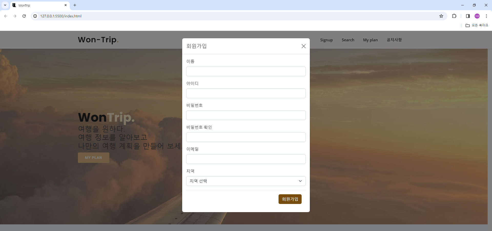
  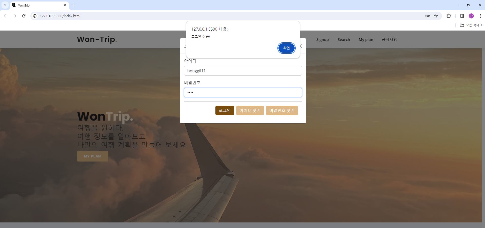

- 마이페이지 (회원 정보 조회, 수정, 삭제)
  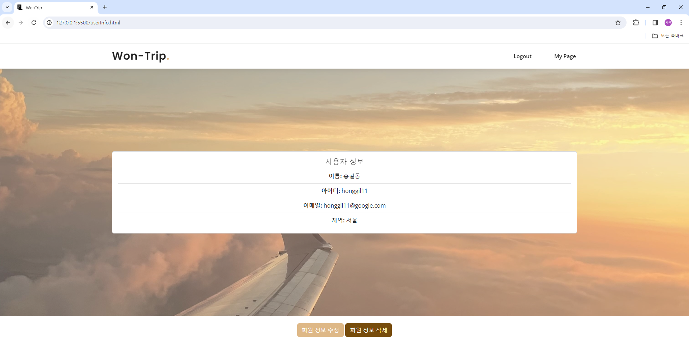
  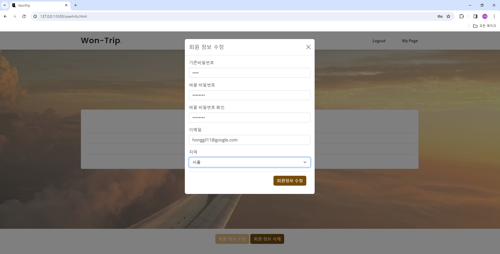
  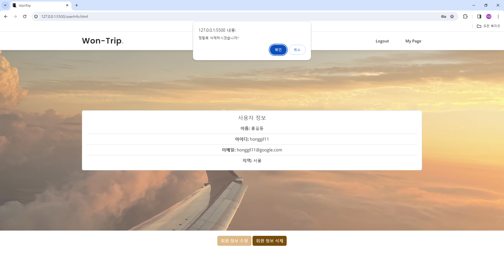

✔ **지역별 관광지 조회 페이지**
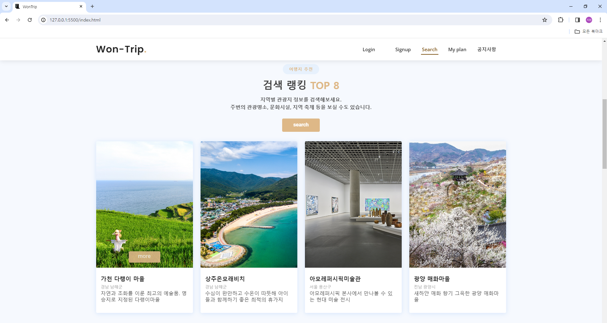

- 검색 랭킹 TOP 8의 관광지의 정보를 표시하고 상세정보는 "more" 버튼 클릭시 웹사이트로 이동
  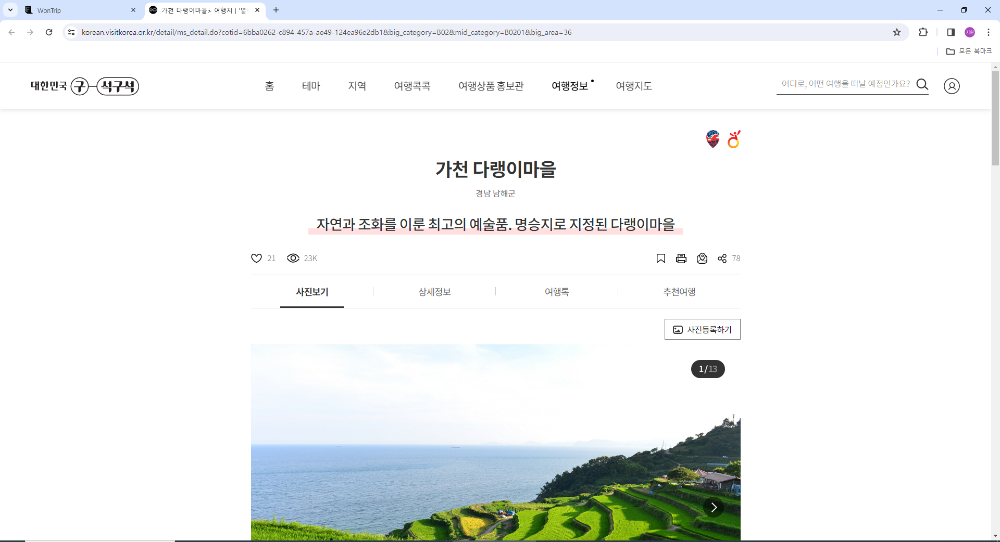

- 지역별 컨텐츠별 관광지 정보 조회
 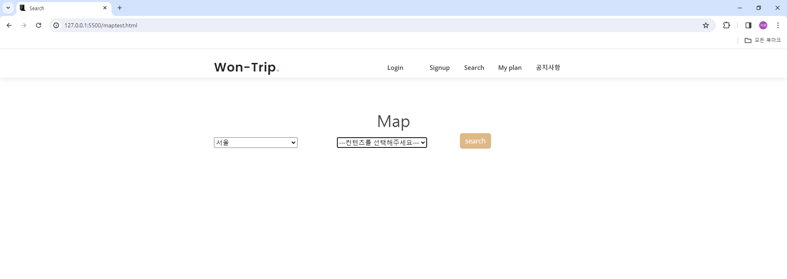

- 조회한 컨텐츠의 위치 정보를 지도에 표시
  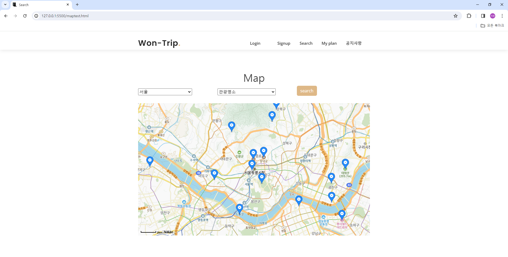
- 지도의 마커를 클릭하여 해당 위치의 상세 정보를 확인하고, 버튼을 통해 내 여행계획에 추가
  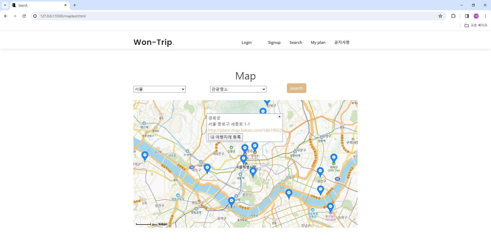

✔ **여행 계획 게시판 페이지**

- 회원들이 올린 여행 계획 표시 & "more" 버튼 클릭시 자세한 계획내용으로 이동
  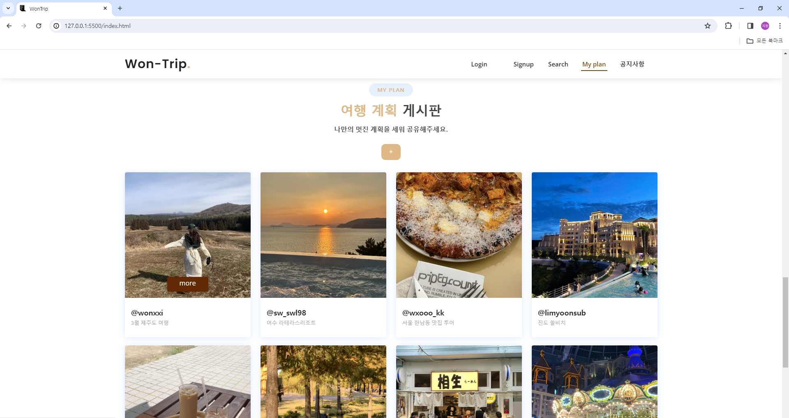
